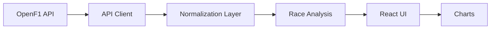

# PitWall — Project Brief

## 1. Visione del progetto

**PitWall** è un'applicazione web pubblica per esplorare e confrontare le strategie di gara in Formula 1.

L'obiettivo non è creare un semplice clone di siti di statistiche F1, ma uno strumento che permetta di capire **come si è evoluta una gara** attraverso dati visuali e confronti tra piloti: posizione giro per giro, tempi sul giro, stint, pit stop e momenti chiave.

Il progetto nasce come progetto personale da portfolio e deve dimostrare capacità di:

- progettazione di un prodotto full-stack;
- integrazione con API esterne;
- normalizzazione e trasformazione di dati;
- data visualization;
- progettazione di un'architettura semplice ma estendibile;
- testing;
- CI/CD con GitHub Actions;
- documentazione tecnica;
- uso consapevole di agenti AI nel processo di sviluppo;
- eventuale integrazione futura con MCP e AI.

Il progetto deve essere realizzabile senza AWS e, per quanto possibile, con servizi gratuiti.

---

## 2. Obiettivo principale

La prima versione deve rispondere in modo molto chiaro a questa domanda:

> **Come si è evoluta la gara di due piloti e quale ruolo hanno avuto ritmo, posizione, stint e pit stop?**

Un utente deve poter:

1. scegliere una stagione;
2. scegliere un Gran Premio;
3. scegliere due piloti;
4. vedere il confronto della loro gara;
5. capire visivamente cosa è successo.

La prima versione deve essere interessante e utilizzabile **anche senza AI, LLM o MCP**.

---

## 3. Principio guida

PitWall deve essere costruito per milestone.

Non bisogna trasformarlo subito in:

- dashboard;
- backend complesso;
- database;
- CLI;
- MCP server;
- chatbot;
- agente AI;
- sistema real-time.

La priorità è avere presto una **demo pubblica funzionante e convincente**.

Ogni livello successivo deve aggiungere valore reale al prodotto.

---

# 4. Fonte dati

La fonte iniziale prevista è **OpenF1**.

Documentazione:

https://openf1.org/docs/

OpenF1 è un'API open source e non ufficiale che espone dati Formula 1.

Al momento della definizione di questo progetto:

- i dati storici dal 2023 in poi sono accessibili gratuitamente;
- i dati storici non richiedono autenticazione;
- sono disponibili formati JSON e CSV;
- il piano gratuito dichiara limiti di richiesta, quindi l'app deve evitare chiamate inutili;
- i dati real-time richiedono invece accesso a pagamento e non fanno parte dell'MVP.

Endpoint potenzialmente utili:

- `sessions`
- `drivers`
- `laps`
- `position`
- `pit`
- `stints`
- `session_result`
- `race_control`

L'agente deve verificare la documentazione OpenF1 corrente prima di implementare integrazioni dipendenti dallo schema API.

---

# 5. MVP

## Funzionalità obbligatorie

### Selezione gara

L'utente deve poter scegliere:

- stagione;
- Gran Premio;
- sessione Race.

Per l'MVP si possono supportare solo gare concluse dal 2023 in poi.

---

### Selezione piloti

L'utente seleziona due piloti presenti nella gara.

Esempio:

- Charles Leclerc
- Lewis Hamilton

L'interfaccia deve rendere immediatamente evidente quali piloti sono confrontati.

---

### Grafico posizione giro per giro

Mostrare l'evoluzione della posizione dei due piloti durante la gara.

Esempio concettuale:

```text
Position

1 ┤
2 ┤   Driver A ─────────
3 ┤             ╲
4 ┤              ╲──────
5 ┤ Driver B ────────────
6 ┤
   └─────────────────────
      10  20  30  40  50
             Lap
```

Requisiti:

- asse X = numero del giro;
- asse Y = posizione;
- posizione 1 visivamente in alto;
- due serie facilmente distinguibili;
- tooltip con giro e posizione.

---

### Grafico tempi sul giro

Mostrare i lap time dei due piloti.

L'utente deve poter individuare:

- differenze di ritmo;
- giri particolarmente lenti;
- eventuali effetti dei pit stop;
- variazioni durante gli stint.

Valutare se escludere o evidenziare separatamente:

- pit-in lap;
- pit-out lap;
- safety car;
- giri anomali.

Non applicare filtri nascosti senza documentarli.

---

### Pit stop

I pit stop devono essere mostrati chiaramente.

Informazioni utili:

- pilota;
- giro;
- durata disponibile;
- posizione prima/dopo, se ricavabile in modo affidabile.

I marker dei pit stop dovrebbero essere visibili almeno su uno dei grafici principali.

---

### Stint

Visualizzare gli stint dei piloti.

Quando i dati lo permettono:

- numero dello stint;
- giro iniziale;
- giro finale;
- compound;
- tyre age iniziale.

Esempio concettuale:

```text
Driver A

SOFT    ━━━━━━━━━━━
              PIT
MEDIUM             ━━━━━━━━━━━━━━━━━
                                  PIT
HARD                              ━━━━━━━━━━━━━
```

---

### Risultato finale

Mostrare almeno:

- posizione finale;
- numero di giri;
- eventuale DNF/DNS/DSQ se disponibile;
- confronto sintetico tra i due piloti.

---

# 6. UX desiderata

Il flusso principale dovrebbe essere:

```text
Home
 ↓
Season
 ↓
Grand Prix
 ↓
Driver A + Driver B
 ↓
Race Comparison
```

La pagina di confronto deve essere il cuore dell'app.

Ordine suggerito:

1. gara selezionata;
2. piloti;
3. risultato finale;
4. position chart;
5. lap-time chart;
6. stint / tyre strategy;
7. pit stops;
8. eventuali eventi di race control rilevanti.

L'interfaccia deve essere leggibile anche da mobile, pur privilegiando l'esperienza desktop per i grafici complessi.

---

# 7. Non-obiettivi dell'MVP

La prima versione **non deve** includere necessariamente:

- account utente;
- login;
- database;
- preferiti;
- notifiche;
- dati live;
- predizioni;
- chatbot;
- LLM;
- MCP;
- telemetria dettagliata;
- simulatore strategico;
- classifiche stagionali;
- fantasy game;
- social features.

Queste funzionalità possono essere considerate solo dopo che il core del prodotto è stabile.

---

# 8. Architettura iniziale

La prima architettura deve essere il più semplice possibile.

Una possibile struttura:

```text
OpenF1 API
    ↓
Data client
    ↓
Normalization layer
    ↓
Analysis functions
    ↓
React UI
    ↓
Charts
```

Tecnologie suggerite:

- TypeScript;
- React;
- Vite oppure framework equivalente;
- libreria chart da valutare;
- Vitest per i test;
- ESLint;
- Prettier;
- GitHub Actions.

L'agente può proporre alternative motivate.

La scelta finale deve privilegiare:

- semplicità;
- manutenzione;
- costo zero;
- buona documentazione;
- facilità di deploy.

---

# 9. Data layer

È importante **non spargere chiamate OpenF1 direttamente nei componenti UI**.

Prevedere almeno tre livelli logici.

## API client

Responsabile delle chiamate HTTP.

Esempi concettuali:

```ts
getSessions(...)
getDrivers(...)
getLaps(...)
getPositions(...)
getPitStops(...)
getStints(...)
```

---

## Normalization layer

Trasforma i dati OpenF1 in modelli interni stabili.

Esempio:

```ts
interface NormalizedLap {
  driverNumber: number
  lapNumber: number
  lapDuration: number | null
  isPitOutLap: boolean
}
```

Lo scopo è evitare che tutta l'app dipenda direttamente dal formato dell'API esterna.

---

## Analysis layer

Funzioni pure o quasi pure che rispondono a domande sul dominio.

Esempi:

```ts
compareLapTimes(...)
getPositionEvolution(...)
getPitStops(...)
getStints(...)
getAveragePace(...)
getPositionChanges(...)
```

Questa separazione sarà molto importante se in futuro verrà aggiunto un MCP server.

---

# 10. Caching

OpenF1 impone limiti alle richieste gratuite.

Quindi bisogna evitare richieste duplicate.

Valutare inizialmente:

- cache in memoria;
- browser cache;
- localStorage;
- IndexedDB;
- query caching tramite libreria dedicata.

Un backend o database centralizzato deve essere introdotto solo se porta un vantaggio reale.

---

# 11. Gestione errori

L'interfaccia deve gestire correttamente:

- API non disponibile;
- rate limit;
- gara senza dati;
- dati incompleti;
- pilota ritirato;
- lap mancanti;
- valori null;
- timeout;
- risposta API cambiata o non valida.

Non assumere che tutti i dataset siano completi.

---

# 12. Testing

Il progetto deve contenere test reali.

Priorità:

## Unit test

Testare soprattutto:

- normalizzazione;
- trasformazione dati;
- confronto tra piloti;
- calcolo stint;
- gestione valori mancanti;
- parsing API.

## Integration test

Verificare almeno il flusso:

```text
mock OpenF1 response
        ↓
normalization
        ↓
analysis
        ↓
expected result
```

La UI può avere test mirati sui componenti più importanti.

Evitare test puramente cosmetici che aumentano il numero di test senza migliorare la sicurezza del progetto.

---

# 13. GitHub Actions

Creare una pipeline CI.

Trigger consigliati:

- push;
- pull request.

Pipeline minima:

```text
checkout
 ↓
install dependencies
 ↓
lint
 ↓
typecheck
 ↓
test
 ↓
build
```

Ogni pull request deve poter essere verificata automaticamente.

In seguito il workflow può includere il deploy automatico della branch `main`.

---

# 14. Deploy

Obiettivo:

**demo pubblica gratuita.**

Opzioni da valutare:

- Cloudflare Pages;
- GitHub Pages, se tecnicamente adatto;
- altro hosting statico gratuito.

Evitare AWS per questo progetto personale.

Il repository deve essere pubblico.

---

# 15. README

Il README deve essere parte integrante del progetto.

Struttura consigliata:

```text
# PitWall

descrizione breve

Screenshot / GIF

Live Demo

## What is PitWall?

## Features

## Architecture

## Data source

## Local development

## Testing

## CI/CD

## Engineering decisions

## Limitations

## Roadmap
```

Inserire un diagramma Mermaid semplice dell'architettura.

Esempio:



---

# 16. Engineering decisions

Durante lo sviluppo creare un file:

```text
docs/decisions.md
```

oppure utilizzare ADR.

Registrare decisioni importanti, per esempio:

- perché React;
- perché una determinata libreria chart;
- perché non usare un database nell'MVP;
- strategia di caching;
- normalizzazione OpenF1;
- gestione dati mancanti;
- eventuale introduzione di backend.

Per ogni decisione annotare:

```text
Problem
Options considered
Decision
Reason
Trade-offs
```

Questo è importante anche perché il progetto verrà sviluppato con forte supporto di agenti AI.

---

# 17. Uso degli agenti AI durante lo sviluppo

Gli agenti AI possono:

- proporre architetture;
- generare codice;
- implementare feature;
- scrivere test;
- eseguire refactoring;
- analizzare bug;
- proporre UI;
- aggiornare documentazione.

Tuttavia non devono prendere automaticamente tutte le decisioni senza renderle esplicite.

Per le decisioni rilevanti l'agente dovrebbe presentare:

```text
Option A
vantaggi
svantaggi

Option B
vantaggi
svantaggi

Recommendation
motivazione
```

Il proprietario del progetto deve poter comprendere e approvare la decisione.

L'obiettivo non è dimostrare che il codice è stato scritto manualmente.

L'obiettivo è dimostrare capacità di:

- definire requisiti;
- prendere decisioni;
- comprendere trade-off;
- verificare implementazioni;
- testare;
- mantenere il sistema.

---

# 18. Definition of Done dell'MVP

L'MVP è completato quando:

- il repository è pubblico;
- esiste una demo pubblica;
- l'utente può selezionare almeno una stagione;
- può selezionare una gara;
- può scegliere due piloti;
- visualizza posizione giro per giro;
- visualizza lap time;
- visualizza pit stop;
- visualizza stint;
- gli errori API principali sono gestiti;
- esistono unit test sulle trasformazioni principali;
- GitHub Actions esegue lint, test e build;
- il README documenta setup e architettura;
- il progetto funziona da checkout pulito.

Solo dopo questo punto si valutano AI e MCP.

---

# 19. Milestone successive

## Milestone 1 — Race Explorer

Obiettivo:

**demo pubblica utilizzabile.**

Feature:

- stagione;
- GP;
- due piloti;
- position chart;
- lap-time chart;
- pit stop;
- stint;
- risultato.

---

## Milestone 2 — Race Analysis Engine

Estrarre la logica analitica dalla UI.

Funzioni possibili:

```text
get_stints(driver)
get_pit_stops(driver)
get_position_changes(driver)
compare_lap_times(driverA, driverB)
get_gap_evolution(driverA, driverB)
get_race_control_events(...)
```

Obiettivo:

rendere l'analisi testabile e indipendente dall'interfaccia.

---

## Milestone 3 — Improved race storytelling

Possibili funzionalità:

- evidenziare undercut / overcut potenziali;
- confrontare ritmo per stint;
- identificare fastest laps personali;
- mostrare safety car / VSC;
- evidenziare sorpassi quando disponibili;
- confronto prima/dopo un pit stop;
- annotazioni automatiche sui grafici.

Queste analisi devono essere basate su regole e dati verificabili.

---

# 20. MCP — futura estensione

MCP non deve essere introdotto prima che l'analysis layer sia maturo.

Una futura architettura potrebbe essere:

```text
                  ┌── Web UI
OpenF1
   ↓              │
Normalization → Analysis Engine
                  │
                  └── MCP Server
                         ↓
                    AI clients
```

Possibili tool MCP:

```text
get_race
get_driver_laps
compare_drivers
get_stints
get_pit_stops
get_position_changes
get_race_control_events
compare_stint_pace
```

Esempio:

> Perché il pilota A ha perso terreno rispetto al pilota B dopo il primo pit stop?

Il client AI potrebbe:

```text
compare_drivers
       ↓
get_pit_stops
       ↓
compare_stint_pace
       ↓
get_position_changes
```

e costruire una risposta basata sui dati.

Il server MCP deve restituire dati strutturati e non opinioni non verificabili.

---

# 21. AI — futura estensione

Un eventuale layer AI deve utilizzare il motore analitico, non sostituirlo.

Architettura desiderata:

```text
User question
     ↓
LLM / Agent
     ↓
structured tools
     ↓
Race Analysis Engine
     ↓
OpenF1 data
```

Esempi di domande:

- Perché Driver A è finito davanti a Driver B?
- Chi aveva un ritmo migliore nel secondo stint?
- Dopo quale pit stop è cambiata maggiormente la distanza tra i due?
- Quale pilota ha recuperato più posizioni?
- Come è cambiata la gara durante la Safety Car?

La risposta dovrebbe indicare i dati utilizzati.

Evitare analisi che attribuiscano causalità quando i dati disponibili mostrano solo correlazioni.

---

# 22. Possibili evoluzioni future

Solo dopo l'MVP.

Idee:

- confronto fino a più piloti;
- visualizzazione completa della griglia;
- race replay;
- circuit map;
- telemetry explorer;
- qualifying explorer;
- confronto tra GP diversi;
- confronto tra compagni di squadra;
- tyre degradation analysis;
- pit strategy comparison;
- race-control timeline;
- storico delle strategie;
- link condivisibili a un confronto;
- PWA;
- MCP remoto;
- AI race analyst.

---

# 23. Cose da evitare

Non aggiungere una tecnologia solo perché interessante.

Evitare:

- microservizi inutili;
- Kubernetes;
- database senza necessità;
- autenticazione prematura;
- infrastruttura complessa;
- AI usata come wrapper decorativo;
- MCP con tool banali che duplicano semplicemente gli endpoint OpenF1;
- metriche inventate;
- interpretazioni presentate come fatti;
- overengineering.

La domanda da porsi prima di aggiungere qualcosa è:

> Questa tecnologia risolve un problema reale di PitWall?

Se la risposta è no, non aggiungerla.

---

# 24. Qualità del progetto

Il progetto deve privilegiare:

1. correttezza dei dati;
2. chiarezza dell'interfaccia;
3. semplicità architetturale;
4. testabilità;
5. leggibilità del codice;
6. documentazione;
7. performance;
8. estetica.

L'estetica è importante per il portfolio, ma non deve nascondere errori o complessità inutile.

---

# 25. Obiettivo portfolio

PitWall deve mostrare che il suo autore è in grado di:

- partire da un problema;
- integrare una fonte dati reale;
- progettare un dominio;
- trasformare dati grezzi in informazioni comprensibili;
- sviluppare frontend e logica applicativa;
- testare il comportamento;
- automatizzare CI/CD;
- documentare decisioni;
- utilizzare strumenti AI come parte del processo di engineering;
- evolvere un'applicazione verso tool use, MCP e agenti quando utile.

Il valore del progetto non deve dipendere dal numero di righe di codice o dal fatto che siano state digitate manualmente.

Deve dipendere dalla qualità del prodotto e delle decisioni tecniche.

---

# 26. Prima attività richiesta all'agente AI

Prima di scrivere codice, l'agente deve:

1. leggere completamente questo documento;
2. consultare la documentazione OpenF1 corrente;
3. proporre un'architettura MVP semplice;
4. proporre lo stack;
5. identificare gli endpoint OpenF1 necessari;
6. spiegare eventuali problemi di rate limiting e caching;
7. proporre la struttura del repository;
8. proporre il modello dati interno;
9. proporre la strategia di testing;
10. proporre le prime milestone implementative.

Per le scelte architetturali importanti deve presentare alternative e trade-off.

Non deve implementare MCP, AI, autenticazione o database nella prima fase, salvo che emerga una necessità concreta e motivata.

---

# 27. Principio finale

> **Build the useful product first. Add intelligence later.**

PitWall deve prima essere un buon prodotto di analisi F1.

AI e MCP devono successivamente rendere più semplice interrogare e comprendere quell'analisi.

Non devono essere il motivo per cui il progetto esiste.
