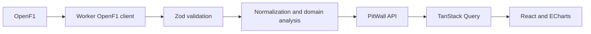

# PitWall

PitWall is an independent Formula 1 race strategy explorer. Pick a completed Grand Prix and two drivers to compare their finishing result, lap positions, pace, tyre stints and pit stops. It uses historical data from [OpenF1](https://openf1.org/).

**[Live demo](https://pitwall.ago-filo-labs.workers.dev)** · [GitHub repository](https://github.com/Ago-filo/Pitwall)


## Features

- Completed races from 2023 onward, depending on OpenF1 availability
- Two-driver position and lap-time charts with pit-out and pit-stop markers
- Tyre stints, pit lane duration and stationary duration when available
- Explicit notes for missing upstream data and unreconstructable lap positions
- Motorsport-inspired responsive interface with animated driver cards and selected Creative Commons portraits
- Responsive layout for desktop and mobile


## Architecture



A Cloudflare Worker serves `/api/*` and Vite serves the React application as static assets from the same deployment. The browser never calls OpenF1 directly. Cloudflare Workers Caching stores completed PitWall API responses, the Worker uses the Cache API for upstream responses, and TanStack Query caches API results in the browser. No database, account or paid API subscription is required.

## Local development

Requires Node.js 24 and npm.

```sh
npm ci
npm run dev
```

Open the local URL printed by Vite. The development server runs the Worker through the Cloudflare Vite plugin. Historical OpenF1 data requires network access.

## Verification

```sh
npm run lint
npm run typecheck
npm test
npm run build
```

GitHub Actions runs these checks on pushes and pull requests. Tests cover timestamp-based position reconstruction, missing data, DNF results and a mocked Worker request.

## Deploy

Authenticate Wrangler with a Cloudflare account, then run `npm run deploy`. The project name and runtime settings live in `wrangler.jsonc`. Set the repository homepage and demo URL in GitHub after publishing.

## Engineering decisions and limitations

See [architecture decisions](docs/decisions.md) and the [OpenF1 data model](docs/openf1-data-model.md). OpenF1 is unofficial and may have incomplete historical data. PitWall does not infer overtakes, causality or strategy outcomes from a position change alone. A position at lap end is an approximation based on timestamped position events and approximate lap starts. The free OpenF1 tier is limited to 3 requests per second and 30 per minute; high concurrent traffic can still encounter `429` errors despite caching. During live F1 sessions, OpenF1 may block unauthenticated historical requests too. PitWall explains this outage and can serve a previously cached response where Cloudflare still has one; a cold cache requires waiting until the session ends.

This is an independent fan project and is not associated with Formula 1, FIA or OpenF1. See [portrait credits and licences](docs/photo-credits.md): portraits are archival and only available for selected drivers; all others use a typographic fallback. The interface does not use official Formula 1, team or sponsor logos as site branding.

## Roadmap

After a stable MVP: race-control context, per-stint pace analysis, shareable comparisons and a reusable analysis engine for future MCP tools.
