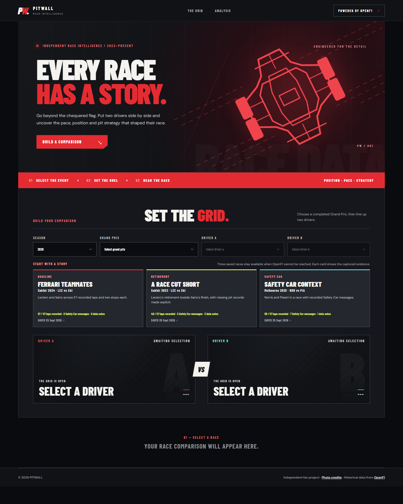
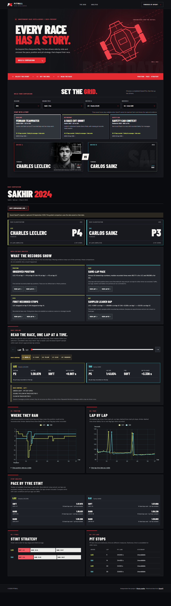
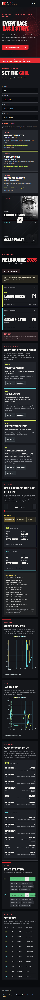
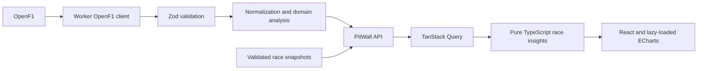

# PitWall

PitWall is an independent Formula 1 race strategy explorer. Pick a completed Grand Prix and two drivers to compare their finishing result, lap positions, pace, tyre stints and pit stops. It uses historical data from [OpenF1](https://openf1.org/).

**[Live demo](https://pitwall.ago-filo-labs.workers.dev)** · [GitHub repository](https://github.com/Ago-filo/Pitwall)

Guided examples: [2023 retirement](https://pitwall.ago-filo-labs.workers.dev/?season=2023&race=7953&drivers=16,55) · [2024 teammate comparison](https://pitwall.ago-filo-labs.workers.dev/?season=2024&race=9472&drivers=16,55) · [2025 Safety Car context](https://pitwall.ago-filo-labs.workers.dev/?season=2025&race=9693&drivers=4,81)



## Features

- Completed races from 2023 onward, depending on OpenF1 availability
- Two-driver position and lap-time charts with pit-out and pit-stop markers
- Evidence-linked Race Analysis for observed positions, same-numbered lap pace, first pit stops and sampled leader gaps
- Interactive lap timeline with synchronized chart markers, race-control messages, sampled gap-to-leader values and driver snapshots
- Per-stint median pace from available timed laps, with explicit pit-lap exclusions
- Three guided races across 2023–2025, including a retirement and Safety Car context, plus shareable comparison links
- Validated, dated snapshots with visible data coverage for all three guided comparisons
- Tyre stints, pit lane duration and stationary duration when available
- Explicit notes for missing upstream data and unreconstructable lap positions
- Motorsport-inspired responsive interface with animated driver cards and selected Creative Commons portraits
- Responsive layout for desktop and mobile, keyboard-visible focus and data tables for both charts
- Charts and ECharts load only when a comparison is shown; renderer and chart engine are separate build chunks



<details>
<summary>Mobile view (390 px)</summary>



</details>

## Architecture



A Cloudflare Worker serves `/api/*` and Vite serves the React application as static assets from the same deployment. The browser never calls OpenF1 directly. Cloudflare Workers Caching stores completed PitWall API responses, the Worker uses the Cache API for upstream responses, and TanStack Query caches API results in the browser. Three dated race snapshots are bundled with the Worker. Guided comparisons are served from them directly, so they remain available when OpenF1 is unavailable. The guided race catalog reports captured coverage and limitations. Other races still depend on OpenF1 or an existing cache. No database, account or paid API subscription is required.

## Local development

Requires Node.js 24 and npm.

```sh
npm ci
npm run dev
```

Open the local URL printed by Vite. The development server runs the Worker through the Cloudflare Vite plugin. Historical OpenF1 data requires network access.

## Guided race snapshots

PitWall includes three provider-backed snapshots: Bahrain 2023 (Leclerc DNF), Bahrain 2024 (teammate baseline), and Australia 2025 (Norris/Piastri with Safety Car messages). The Worker exposes their metadata through GET /api/highlights. The UI shows each snapshot's capture date, recorded lap counts, Safety Car message count and number of data notes. A saved comparison is available in either driver order; other driver pairs still use OpenF1.

Each snapshot is checked against the requested race and drivers, and the saved coverage is tested against the comparison data. See [the snapshot catalog and refresh procedure](docs/snapshot-catalog.md). To refresh one when historical OpenF1 access is available, run the app locally and then:

~~~sh
npm run capture:snapshot -- bahrain-2023
npm run capture:snapshot -- bahrain-2024
npm run capture:snapshot -- australia-2025
~~~

Pass a PitWall base URL after the ID to capture from another instance. The existing npm run capture:featured command remains an alias for Bahrain 2024. The capture script bypasses the saved comparison, rejects snapshot responses, validates required fields and refuses to overwrite a scenario whose defining evidence has disappeared.

## Verification

```sh
npm run lint
npm run typecheck
npm test
npm run build
```

GitHub Actions runs these checks on pushes and pull requests. Tests cover timestamp-based position and gap alignment, race-control filtering, missing data, DNF results, stint pace, race-insight evidence rules and mocked Worker requests. The analysis rules and a worked fixture are documented in [Race Analysis](docs/race-analysis.md).

## Deploy

Authenticate Wrangler with a Cloudflare account, then run `npm run deploy`. The project name and runtime settings live in `wrangler.jsonc`. Set the repository homepage and demo URL in GitHub after publishing.

## Engineering decisions and limitations

See [architecture decisions](docs/decisions.md) and the [OpenF1 data model](docs/openf1-data-model.md). OpenF1 is unofficial and may have incomplete historical data. PitWall does not infer overtakes, causality or strategy outcomes from a position change alone. Race Analysis presents descriptive observations only when the required samples exist. A position at lap end is an approximation based on timestamped position events and approximate lap starts. Gap-to-leader is the latest OpenF1 sample within each approximate lap window; it is not a synchronized head-to-head gap. The free OpenF1 tier is limited to 3 requests per second and 30 per minute; high concurrent traffic can still encounter `429` errors despite caching. During live F1 sessions, OpenF1 may block unauthenticated historical requests too. The three guided comparisons remain available; other uncached comparisons require waiting until the session ends.

This is an independent fan project and is not associated with Formula 1, FIA or OpenF1. See [portrait credits and licences](docs/photo-credits.md): portraits are archival and only available for selected drivers; all others use a typographic fallback. The interface does not use official Formula 1, team or sponsor logos as site branding.

## Roadmap

Completed: race-control context, sampled leader gaps, per-stint pace, shareable comparisons, an evidence-linked Race Analysis, three validated guided comparisons, accessible chart tables and deferred chart loading.

Next: build a race story from recorded turning points with explicit evidence and session-state windows when source coverage permits; expand automated accessibility and browser checks. Future integrations, including MCP tools, can reuse the pure TypeScript analysis rules.
